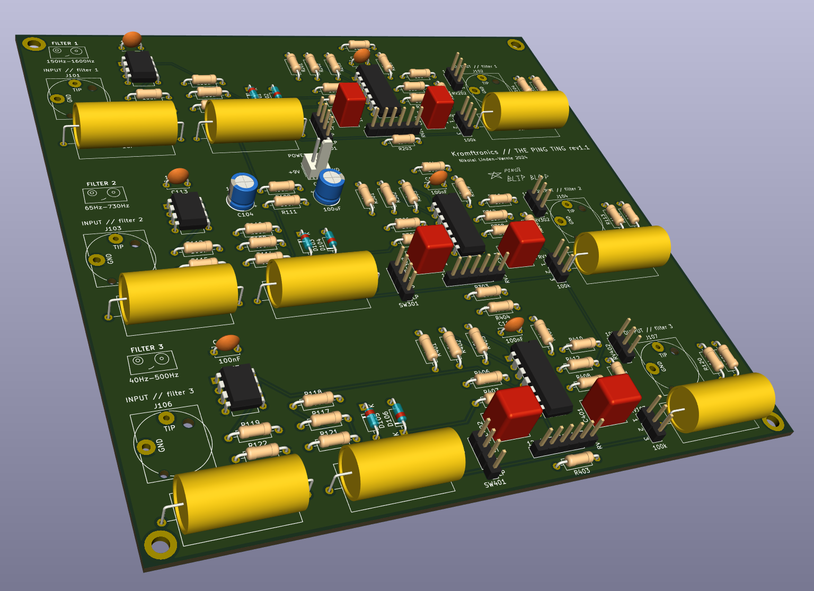
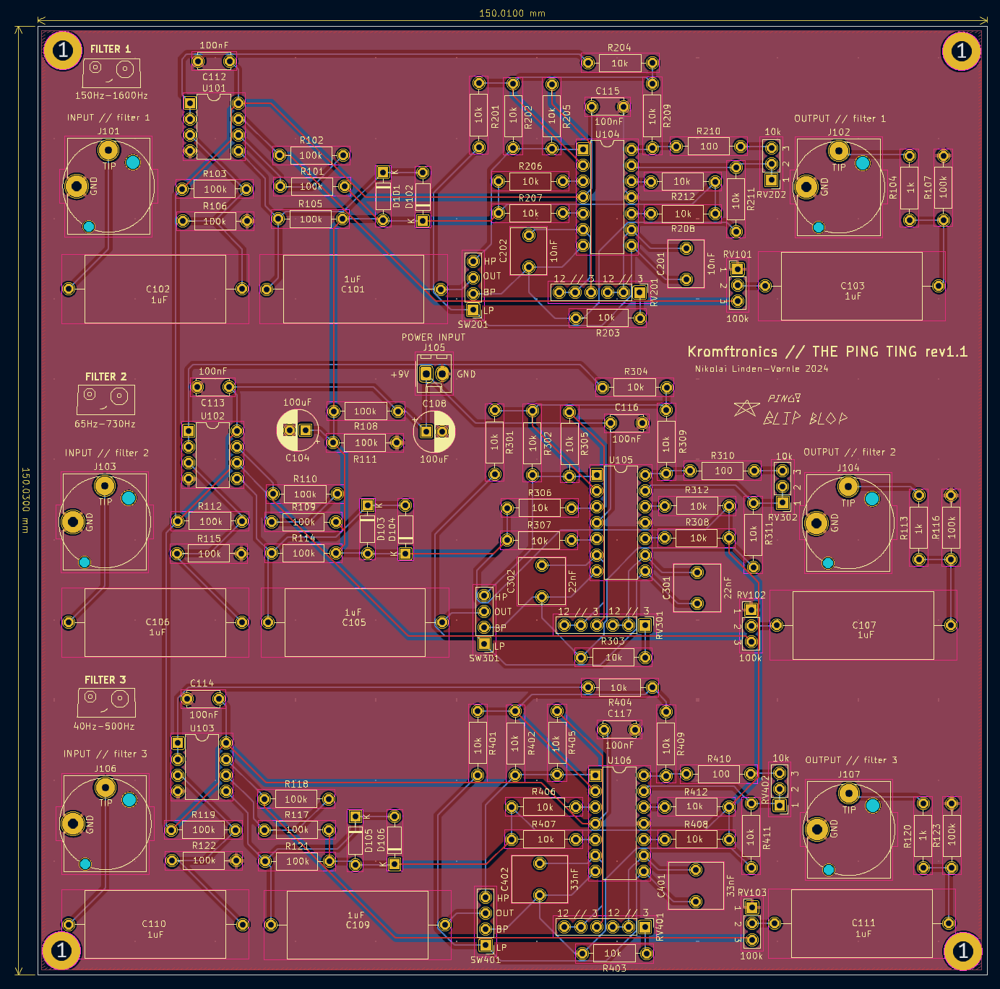
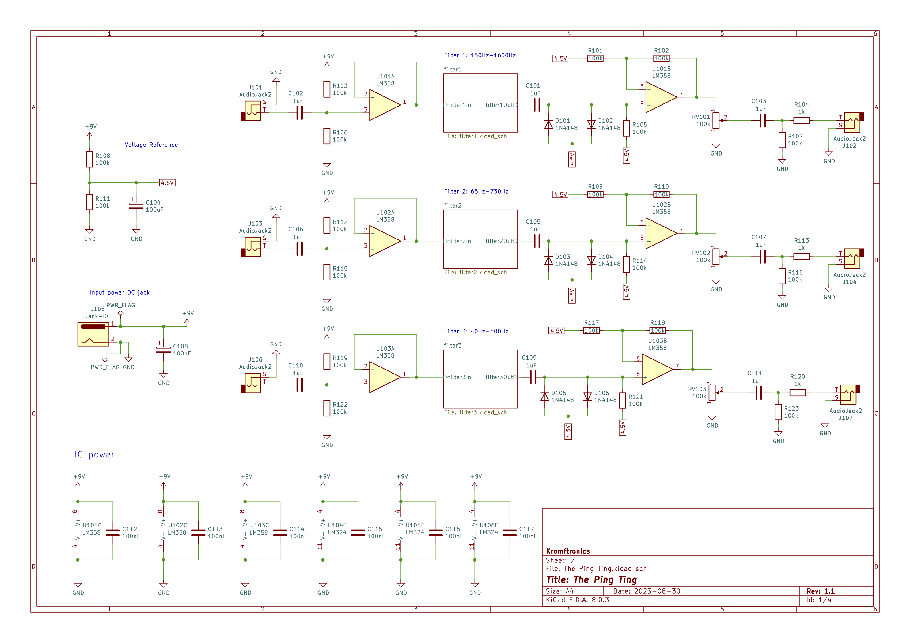

# The Ping Ting
This repository contains the KiCad files and the design files for *The Ping Ting*.

The Ping Ting is a single PCB with three different high-Q state variable filters, which are intended to be used for "filter pinging".
The board can be supplied from a typical 9V-12V DC center positive power supply.
**NOTE**: some of the filters can go into self oscillation, so be carefull.

## REV 1.1 Images

### 3D Model

### PCB

### Schematic

